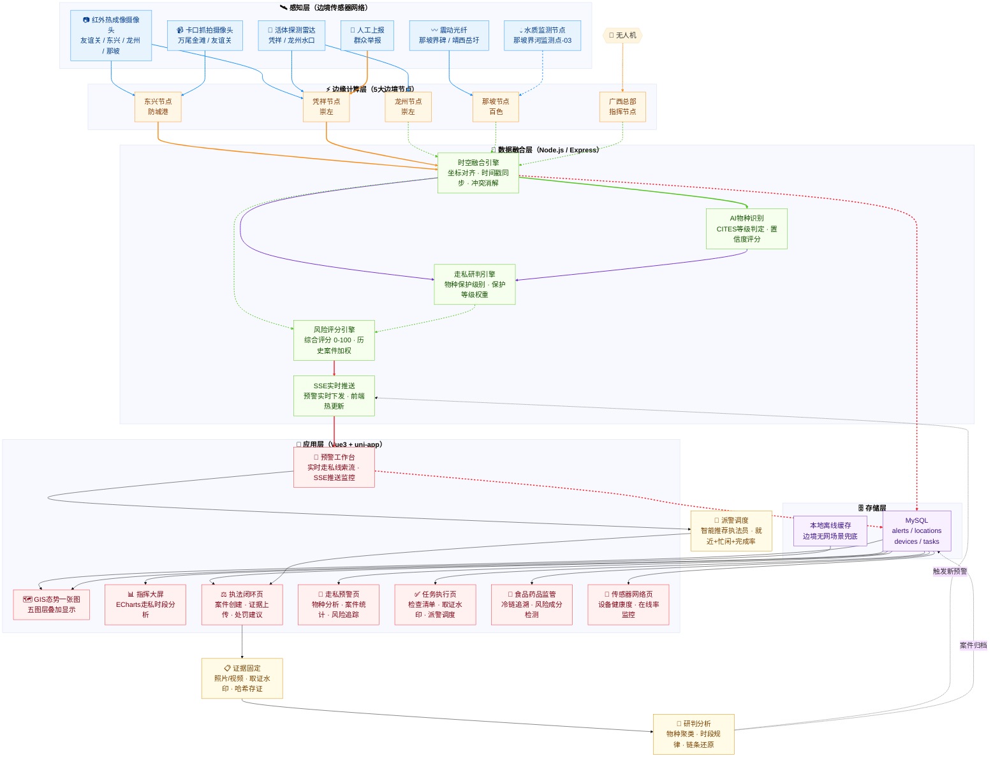

# 热眼擒枭 - 边境活物走私智能防控与生态协同预警平台

<p align="center">
  
  
  
</p>

## 项目简介

**热眼擒枭**是一款专为边境一线打造的智能防控与生态协同预警平台。项目以"生态警务"为统领，立足环境资源与食药侦查职能，聚焦广西边境口岸等复杂地带的实战需求。

系统基于"云-边-端"协同架构，创新性地将"边境活物走私防控"与"生态环境监测"双轨融合。依托红外监测、震动光纤及水质传感器等多源感知设备，平台能精准捕捉非法越界与生态异常信号。

## 技术架构

### 多传感器融合架构图



---

### 系统定位

<div align="center">

| 防控职能 | 本系统对应功能 |
|:--------:|:--------------|
| **走私预警** | 红外/雷达/震动光纤多源感知，AI物种识别，实时走私风险评分 |
| **边境布控** | 5大边境节点边缘计算，GIS一张图五图层叠加，全域态势感知 |
| **执法处置** | 任务执行与检查清单，证据固定与取证水印，案件闭环处置 |
| **数据分析** | ECharts指挥大屏，走私时段分析，历史案件加权研判 |

</div>

---

### 架构分层说明

<div align="center">

| 层级 | 核心组件 | 说明 |
|:----:|:--------:|:-----|
| **感知层** | 红外摄像头 / 震动光纤 / 活体雷达 / 卡口摄像 / 无人机 | 广西中越边境5大口案全天候监测 |
| **边缘计算层** | 5个边缘节点 | 就近处理原始数据，降低主干网压力 |
| **数据融合层** | 时空融合引擎 + AI物种识别 + 走私研判 + 风险评分 + SSE推送 | 多源对齐、物种判定、保护等级权重、风险量化、实时下发 |
| **存储层** | MySQL + 本地离线缓存 | 结构化存储 + 边境无网络场景兜底 |
| **应用层** | Vue3 + uni-app 八大功能页 | 走私预警 + 执法闭环 + GIS态势 + 指挥大屏 + 任务执行 + 食品药品监管 + 设备监控 + 预警工作台 |

</div>

---

### 多传感器融合策略

<div align="center">

| 融合维度 | 策略 |
|:--------:|:-----|
| **空间融合** | 所有传感器数据统一转换为 GCJ-02 坐标系，与边境界碑编号精确对齐 |
| **时间融合** | 边缘节点 NTP 时钟同步，毫秒级时间戳对齐，消除异步触发误判 |
| **语义融合** | AI 物种识别结果 + CITES 数据库比对 → 自动判定走私等级 |
| **走私风险融合** | 历史案件权重 × 当前触发强度 × 地理敏感度 → 综合风险评分 0-100 |

</div>

---

## 技术栈

### 移动端 (uni-app)
- **框架**: uni-app + Vue 3 Composition API
- **状态管理**: Pinia
- **样式**: SCSS
- **HTTP**: uni.request
- **实时通信**: WebSocket
- **离线支持**: 本地存储 + 同步引擎

### 管理后台 (React)
- **框架**: React 18 + Vite
- **UI库**: Ant Design 5
- **图表**: ECharts
- **路由**: React Router 6
- **HTTP**: Axios

### 后端 (Node.js)
- **框架**: Express.js
- **ORM**: Sequelize
- **数据库**: MySQL 8.0
- **缓存**: Redis
- **实时通信**: Socket.IO
- **安全**: Helmet, JWT, Joi

## 功能特性

### 核心功能

- **智能预警**: 基于AI多模态融合的走私/生态预警
- **任务调度**: 四类任务的全流程管理
- **设备监控**: 多种传感器设备的状态监控
- **GIS态势图**: 五大战区实时态势展示
- **执法取证**: 防伪溯源的证据采集与校验
- **统计分析**: 多维度数据统计与可视化

### 权限体系 (RBAC)

<div align="center">

| 角色 | 权限说明 |
|:-----|:--------|
| 一线执勤 | 查看预警/任务，执行处置，采集取证 |
| 侦查研判 | 预警核查，取证分析，任务创建 |
| 指挥调度 | 预警分配，任务派发，设备配置 |
| 系统管理员 | 系统配置，用户管理，全权限 |

</div>

## 快速开始

### 环境要求

- Node.js >= 16.0.0
- MySQL 8.0+
- Redis 6.0+ (可选)

### 1. 克隆项目

```bash
git clone <repository-url>
cd reyanqinxiao
```

### 2. 配置后端

```bash
cd back-end
cp .env.example .env
# 编辑 .env 配置数据库连接
```

```env
PORT=5000
NODE_ENV=development
DB_HOST=localhost
DB_PORT=3306
DB_NAME=reyanqinxiao
DB_USER=root
DB_PASSWORD=your_password
JWT_SECRET=your_jwt_secret
```

### 3. 初始化数据库

```bash
# 执行SQL脚本
mysql -u root -p < SQL_NEW/01_init.sql
mysql -u root -p < SQL_NEW/02_seed.sql
mysql -u root -p < SQL_NEW/03_rbac.sql
```

### 4. 启动后端

```bash
npm install
npm run dev
```

### 5. 启动移动端 (HBuilderX)

```bash
cd front-end
# 使用 HBuilderX 打开项目
# 运行到模拟器/真机
```

### 6. 启动管理后台

```bash
cd admin
npm install
npm run dev
```

管理后台访问地址: http://localhost:3001

## 项目结构

```
reyanqinxiao/
├── front-end/              # uni-app 移动端
│   ├── pages/              # 页面组件
│   ├── stores/             # Pinia 状态管理
│   ├── utils/              # 工具函数
│   ├── App.vue             # 应用入口
│   └── pages.json          # 路由配置
│
├── admin/                  # React 管理后台
│   ├── src/
│   │   ├── pages/          # 页面组件
│   │   ├── components/      # 公共组件
│   │   ├── utils/          # 工具函数
│   │   └── App.jsx         # 应用入口
│   ├── vite.config.js      # Vite 配置
│   └── package.json
│
├── back-end/               # Express 后端
│   ├── src/
│   │   ├── routes/         # 路由定义
│   │   ├── middleware/      # 中间件
│   │   ├── models/          # 数据模型
│   │   ├── services/        # 业务服务
│   │   └── server.js        # 服务入口
│   └── package.json
│
├── SQL_NEW/                # 数据库脚本
│   ├── 01_init.sql          # 数据库初始化
│   ├── 02_seed.sql          # 种子数据
│   ├── 03_rbac.sql          # 权限数据
│   └── README.md            # 数据库文档
│
└── README.md               # 项目说明文档
```

## API 文档

详细API文档请参考 [API.md](./API.md)

基础接口前缀: `/api/v1`

<div align="center">

| 模块 | 路由 | 说明 |
|:-----|:-----|:-----|
| 认证 | `/api/v1/auth` | 登录、注册、登出 |
| 预警 | `/api/v1/alerts` | 预警CRUD、分配、解决 |
| 任务 | `/api/v1/tasks` | 任务CRUD、进度管理 |
| 设备 | `/api/v1/devices` | 设备CRUD、心跳监控 |
| 取证 | `/api/v1/evidence` | 证据上传、校验 |
| 统计 | `/api/v1/stats` | 数据统计、分析 |
| 日志 | `/api/v1/logs` | 系统日志 |

</div>

## 部署指南

详细部署文档请参考 [DEPLOY.md](./DEPLOY.md)

### Docker 部署

```bash
# 构建镜像
docker build -t reyanqinxiao .

# 运行容器
docker run -d -p 5000:5000 --env-file .env reyanqinxiao
```

### PM2 部署

```bash
# 安装 PM2
npm install -g pm2

# 启动服务
pm2 start back-end/src/server.js --name reyanqinxiao-api

# 保存进程列表
pm2 save

# 设置开机自启
pm2 startup
```

## 开发指南

### 代码规范

- 遵循 ESLint + Prettier 规范
- 使用 Git Flow 工作流
- 提交信息使用约定式提交

### 环境变量

<div align="center">

| 变量名 | 说明 | 默认值 |
|:-------|:-----|:-------|
| PORT | 服务端口 | 5000 |
| NODE_ENV | 运行环境 | development |
| DB_* | 数据库配置 | - |
| JWT_SECRET | JWT密钥 | - |
| CORS_ORIGIN | CORS白名单 | http://localhost:3000 |

</div>

## 团队分工

本项目采取"四组协同"模式，围绕"走私活物防控 + 环境监测"核心方向展开分工：

<div align="center">

| 组别 | 核心职责 | 关键目标 |
|:-----|:---------|:--------|
| **算法组** | 影子追踪 V2.0 + 多模态融合算法 | 识别准确率 > 85%，适配低成本硬件 |
| **开发组** | uni-app 四大核心页面（登录/GIS/预警/取证）+ 离线缓存 | 完整功能交付，稳定运行 |
| **硬件组** | 传感器选型采购 + 最小感知系统 + 数据传输通道 | 传感器节点稳定上报数据 |
| **设计组** | 暗色模式规范 + 大按钮战术交互 + 戴手套盲操优化 | 一线可用性 ≥ 90% |

</div>

详见 [产品说明文档](./shuomingwendang.md)。

---

## License

MIT License

## 联系方式

- 项目负责人: [团队名称]
- 技术支持: [邮箱地址]

---

<p align="center">热眼擒枭 - 守护边境生态安全</p>
