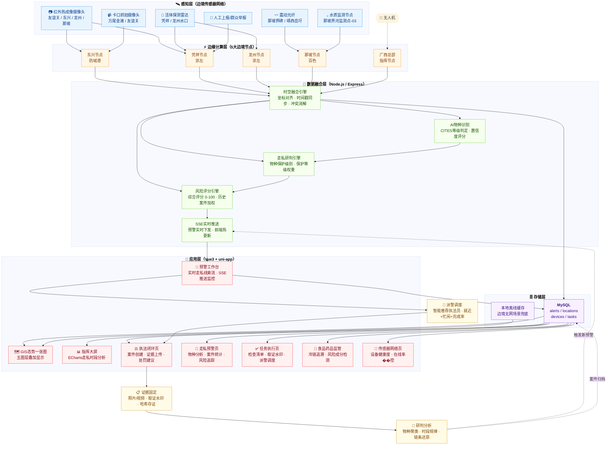

# 热眼擒枭 - 边境活物走私智能防控引领者

热眼擒枭平台是一套面向边境活物走私防控场景的软件系统，集成移动端、管理后台、服务端及数据库管理能力，围绕"态势感知、预警管理、任务处置、设备监控、执法取证、统计研判"构建完整业务闭环。系统通过 GIS 可视化展示、多角色权限协同、实时预警联动和证据链管理，提升边境一线执法工作的数字化、智能化和协同化水平。

## 在线访问

访问地址：https://ppqqmeimei-create.github.io/reyanqinxiao/architecture/

## 本地运行

```bash
# 直接在浏览器中打开
open index.html
# 或使用 Python 服务
python -m http.server 8000
# 访问 http://localhost:8000
```

## 部署到 GitHub Pages

1. 在 GitHub 上创建仓库 `reyanqinxiao`
2. 推送代码到 `gh-pages` 分支
3. 在仓库 Settings → Pages 中选择 `gh-pages` 分支

## 多传感器融合架构图



---

## 在线访问

访问地址：https://ppqqmeimei-create.github.io/reyanqinxiao/architecture/

## 本地运行

```bash
# 直接在浏览器中打开
open index.html
# 或使用 Python 服务
python -m http.server 8000
# 访问 http://localhost:8000
```

## 部署到 GitHub Pages

1. 在 GitHub 上创建仓库 `reyanqinxiao`
2. 推送代码到 `gh-pages` 分支
3. 在仓库 Settings → Pages 中选择 `gh-pages` 分支

## 架构说明

本页面展示了热眼擒枭系统的三层架构：

### 云端层（数据中心）
- 态势感知：实时监控大屏
- AI研判：多模态融合分析
- 任务调度：智能任务分配
- 数据分析：趋势预测研判

### 边缘层（计算节点）
- 战区1 · 东兴
- 战区2 · 凭祥
- 战区3 · 龙州
- 战区4 · 靖西
- 战区5 · 那坡

### 设备层（感知终端）
- 红外热成像
- GPS定位
- 振动光纤
- 单兵设备
- 可见光摄像
- 无人机
- 气味传感
- 水质传感

## 技术栈

- Vue 3 / uni-app
- Node.js / Express
- MySQL / Redis
- WebSocket
- 红外热成像 / 振动光纤
- 边缘计算 / AI研判
- 多模态融合 / 离线同步
- 防伪取证 / GIS地图

---

**热眼擒枭 - 用科技守护绿水青山，用智慧筑牢边境防线**
