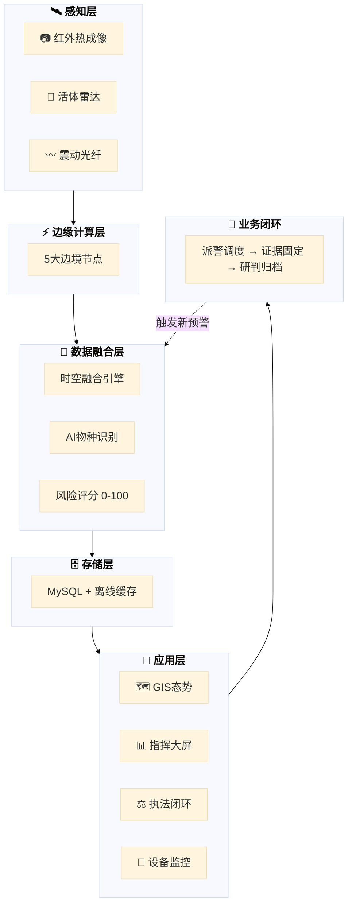

# 热眼擒枭 - 边境活物走私智能防控引领者

热眼擒枭平台是一套面向边境活物走私防控场景的软件系统，集成移动端、管理后台、服务端及数据库管理能力，围绕"态势感知、预警管理、任务处置、设备监控、执法取证、统计研判"构建完整业务闭环。系统通过 GIS 可视化展示、多角色权限协同、实时预警联动和证据链管理，提升边境一线执法工作的数字化、智能化和协同化水平。

## 在线访问

访问地址：https://ppqqmeimei-create.github.io/reyanqinxiao/architecture/

## 本地运行

```bash
# 直接在浏览器中打开
open index.html
# 或使用 Python 服务
python -m http.server 8000
# 访问 http://localhost:8000
```

## 部署到 GitHub Pages

1. 在 GitHub 上创建仓库 `reyanqinxiao`
2. 推送代码到 `gh-pages` 分支
3. 在仓库 Settings → Pages 中选择 `gh-pages` 分支

## 多传感器融合架构图



---

## 架构说明

### 层级结构

| 层级 | 说明 |
|:----:|:-----|
| **感知层** | 红外热成像 / 活体雷达 / 震动光纤 |
| **边缘计算层** | 5大边境节点就近处理数据 |
| **数据融合层** | 时空融合 + AI物种识别 + 风险评分 |
| **存储层** | MySQL结构化存储 + 离线缓存兜底 |
| **应用层** | GIS态势 / 指挥大屏 / 执法闭环 / 设备监控 |
| **业务闭环** | 派警调度 → 证据固定 → 研判归档 |

### 技术栈

- **前端**：Vue 3 + uni-app
- **后端**：Node.js + Express
- **数据库**：MySQL
- **通信**：WebSocket / SSE 实时推送
- **感知**：红外热成像 / 振动光纤 / 活体雷达

---

**热眼擒枭 - 用科技守护绿水青山，用智慧筑牢边境防线**
