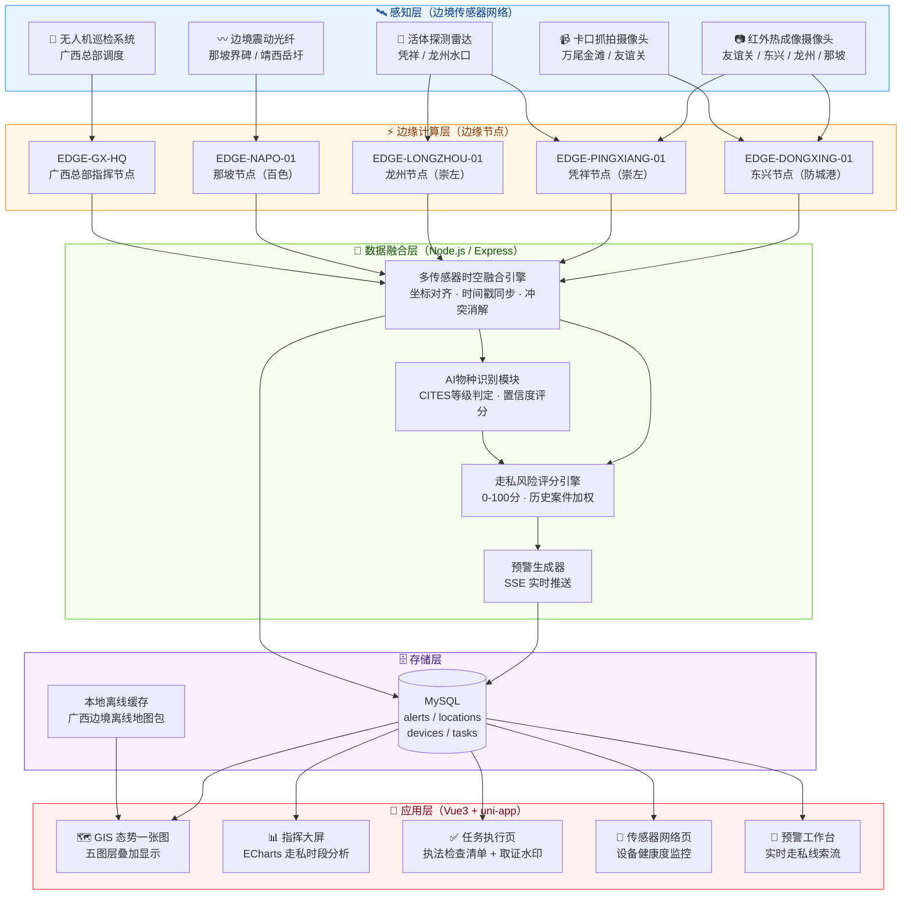

# 🦅 热眼擒枭——边境活物走私智能防控系统

> **主办单位**：环境资源和食品药品侦查总队  
> **系统定位**：生态警务实战平台 · 边境活物走私智能防控  
> **技术栈**：Vue3 + uni-app + Node.js (Express) + MySQL + ECharts  
> **覆盖区域**：广西中越边境全线（东兴 · 凭祥 · 龙州 · 那坡 · 靖西）

---

## 📐 多传感器融合架构图



---

## 🎯 系统定位

本系统以**生态警务**为统领，立足**环境资源和食品药品侦查总队**职能，将**边境活物走私防控**作为核心实战场景，构建「感知 → 预警 → 处置 → 取证 → 研判」闭环能力。

| 职责线 | 本系统对应功能 |
|--------|---------------|
| **环境资源线** | 野生动物保护、CITES物种识别、界碑布控、生态预警 |
| **食品药品线** | 活体检疫缺失风险、非法食药链条追溯 |
| **公安侦查线** | 走私链条打击、证据固定、案件闭环处置 |

---

## 🏗️ 架构分层说明

| 层级 | 核心组件 | 说明 |
|------|---------|------|
| **感知层** | 红外摄像头 / 震动光纤 / 活体雷达 / 卡口摄像 / 无人机 | 分布于广西中越边境5大口岸 |
| **边缘计算层** | 5个边缘节点 | 就近处理原始数据，降低主干网压力 |
| **数据融合层** | 时空融合引擎 + AI识别 + 风险评分 | 多源数据对齐、物种判定、威胁量化 |
| **存储层** | MySQL + 本地离线缓存 | 结构化存储 + 边境无网络场景兜底 |
| **应用层** | Vue3 + uni-app 五大功能页 | 移动端警务执法 + 指挥大屏 |

---

## 🔀 多传感器融合策略

| 融合维度 | 策略 |
|---------|------|
| **空间融合** | 所有传感器数据统一转换为 GCJ-02 坐标系，与界碑编号精确对齐 |
| **时间融合** | 边缘节点 NTP 时钟同步，毫秒级时间戳对齐，消除异步触发误判 |
| **语义融合** | AI 物种识别结果 + CITES 数据库比对 → 自动判定走私等级 |
| **风险融合** | 历史案件权重 × 当前触发强度 × 地理敏感度 → 综合评分 0-100 |

---

## 📁 项目结构

```
热眼擒枭/
├── front-end/            # Vue3 + uni-app 前端
│   ├── pages/
│   │   ├── GIS/          # 态势一张图（五图层GIS）
│   │   ├── Dashboard/    # 指挥大屏（ECharts）
│   │   ├── Alert Center/ # 预警工作台
│   │   ├── Task/         # 任务执行（检查清单+取证）
│   │   ├── Device/       # 传感器网络管理
│   │   ├── FoodDrug/     # 食品药品监管
│   │   └── login/        # 登录（多模式认证）
│   └── static/
│       ├── icons/        # 业务图标（边境/设备/状态）
│       ├── icons-2/      # 预警图标
│       ├── icons-3/      # 取证图标
│       └── tabbar/       # 底部导航图标
├── back-end/             # Node.js + Express API
│   └── src/
│       ├── routes/       # RESTful API 路由
│       └── server.js     # 入口文件
└── SQL/                  # MySQL 数据库脚本
    ├── 01_create_database.sql
    ├── 25_guangxi_border_seed.sql  # 广西边境种子数据
    └── DATABASE_DESIGN.md
```

---

## 🚀 快速启动

### 后端

```bash
cd back-end
npm install
npm run dev
# API 服务运行于 http://localhost:5000
```

### 前端

```bash
cd front-end
npm install
npm run dev
# 在 HBuilderX 中打开并运行到微信小程序
```

### 数据库

```bash
# 在 MySQL 中按序执行 SQL/ 目录下的脚本
mysql -u root -p < SQL/01_create_database.sql
mysql -u root -p reyanjingxiao < SQL/25_guangxi_border_seed.sql
```

---

## 📜 执法法律依据

| 法律法规 | 适用条款 | 场景 |
|---------|---------|------|
| 《野生动物保护法》 | 第二十三条 | 非法出售/运输重点保护野生动物 |
| 《刑法》 | 第三百四十一条 | 走私珍贵濒危野生动物罪 |
| 《濒危野生动植物种国际贸易公约》 | CITES 附录 I/II | 跨境贸易许可核验 |
| 《广西壮族自治区野生动物保护条例》 | 第三十五条 | 地方执法处罚依据 |
| 《海关法》 | 第八十二条 | 口岸走私货物扣押 |

---

> **版权声明**：© 环境资源和食品药品侦查总队 · 热眼擒枭项目组  
> 本系统仅限授权执法人员使用，未授权访问将被记录追责。
