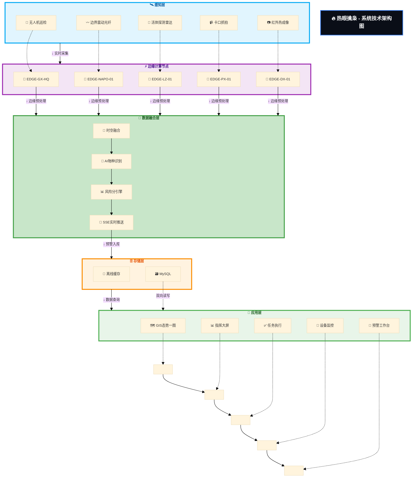

# 热眼擒枭 - 边境活物走私智能防控引领者

热眼擒枭平台是一套面向边境活物走私防控场景的软件系统，集成移动端、管理后台、服务端及数据库管理能力，围绕"态势感知、预警管理、任务处置、设备监控、执法取证、统计研判"构建完整业务闭环。系统通过 GIS 可视化展示、多角色权限协同、实时预警联动和证据链管理，提升边境一线执法工作的数字化、智能化和协同化水平。

## 在线访问

访问地址：https://ppqqmeimei-create.github.io/reyanqinxiao/architecture/

## 本地运行

```bash
# 直接在浏览器中打开
open index.html
# 或使用 Python 服务
python -m http.server 8000
# 访问 http://localhost:8000
```

## 部署到 GitHub Pages

1. 在 GitHub 上创建仓库 `reyanqinxiao`
2. 推送代码到 `gh-pages` 分支
3. 在仓库 Settings → Pages 中选择 `gh-pages` 分支

## 多传感器融合架构图

```mermaid
%%{init: {'theme': 'base', 'themeVariables': { 
    'fontSize': '14px', 
    'nodeSpacing': '20',
    'rankSpacing': '35',
    'primaryColor': '#3b82f6'
}}}%%
flowchart TD
    %% ============ 主标题 ============
    TITLE["<b>🔥 热眼擒枭 - 多传感器融合架构</b>"]
    
    %% ============ 感知层 ============
    subgraph SENSING["<b>🛰️ 感知层</b>"]
        direction LR
        S1["📷 红外"]
        S2["📡 雷达"]
        S3["〰️ 震动"]
        S4["📹 卡口"]
        S5["💧 水质"]
        S6["📝 人工"]
        S7["🚁 无人机"]
    end
    
    %% ============ 边缘计算层 ============
    subgraph EDGE["<b>⚡ 边缘计算层</b>"]
        direction LR
        E1["①东兴"]
        E2["②凭祥"]
        E3["③龙州"]
        E4["④那坡"]
        E5["⑤总部"]
    end
    
    %% ============ 数据融合层 ============
    subgraph FUSION["<b>🧠 数据融合层</b>"]
        direction LR
        F1["🔗 时空融合"]
        F2["🤖 AI识别"]
        F3["⚖️ 研判引擎"]
        F4["📊 风险评分"]
        F5["🚨 预警生成"]
    end
    
    %% ============ 存储层 ============
    subgraph STORAGE["<b>🗄️ 存储层</b>"]
        direction LR
        DB["🗃️ MySQL"]
        CACHE["💾 离线缓存"]
    end
    
    %% ============ 应用层 ============
    subgraph APP["<b>📱 应用层</b>"]
        direction LR
        P1["🗺️ GIS"]
        P2["📊 大屏"]
        P3["⚖️ 执法"]
        P4["🔴 预警"]
        P5["✅ 任务"]
        P6["🔧 设备"]
    end
    
    %% ============ 执法闭环 ============
    subgraph ENFORCE["<b>📡 执法闭环</b>"]
        direction LR
        L1["🚔 派警"]
        L2["📋 取证"]
        L3["🔍 研判"]
        L4["📁 归档"]
    end
    
    %% ============ 数据流向（全部向下） ============
    SENSING -->|"↓ 多源数据汇聚"| EDGE
    EDGE -->|"↓ 边缘处理"| FUSION
    F1 --> F2 --> F3 --> F4 --> F5
    FUSION -->|"↓ 分析结果"| STORAGE
    STORAGE -->|"↓ 数据支撑"| APP
    APP -->|"↓ 预警触发"| ENFORCE
    L1 --> L2 --> L3 --> L4
    L4 -.->|"↑ 触发新预警"| F5
    
    %% ============ 样式定义 ============
    classDef SENSING fill:#dbeafe,stroke:#3b82f6,stroke-width:3px,color:#1e40af
    classDef EDGE fill:#fef3c7,stroke:#f59e0b,stroke-width:3px,color:#92400e
    classDef FUSION fill:#d1fae5,stroke:#10b981,stroke-width:3px,color:#065f46
    classDef STORAGE fill:#ede9fe,stroke:#8b5cf6,stroke-width:3px,color:#5b21b6
    classDef APP fill:#fee2e2,stroke:#ef4444,stroke-width:3px,color:#991b1b
    classDef ENFORCE fill:#fef9c3,stroke:#eab308,stroke-width:3px,color:#854d0e
    classDef TITLE fill:#f8fafc,stroke:#64748b,stroke-width:2px,color:#1e293b,font-size:16px

    class SENSING SENSING
    class EDGE EDGE
    class FUSION FUSION
    class STORAGE STORAGE
    class APP APP
    class ENFORCE ENFORCE
    class TITLE TITLE
```



---

### 系统技术架构图


```

---

### 架构特点

- **🛰️ 多源感知**: 7类传感器协同，覆盖红外、雷达、震动、视觉、水质等多种维度
- **⚡ 边缘计算**: 5大节点分布式部署，就近实时处理，降低网络延迟
- **🧠 智能融合**: 时空数据融合 + AI物种识别 + 风险研判全链路分析
- **🔄 闭环运营**: 从预警到执法全流程闭环管理，数据持续迭代优化

---

## 架构说明

### 层级结构

| 层级 | 核心组件 | 功能说明 |
|:----:|:---------|:---------|
| **🛰️ 感知层** | 红外/雷达/震动/卡口/水质/人工/无人机 | 7类终端采集边境多维度数据 |
| **⚡ 边缘层** | 东兴、凭祥、龙州、那坡、广西总部 | 5大节点就近实时处理 |
| **🧠 融合层** | 时空融合 + AI识别 + 研判引擎 + 风险评分 | 多模态数据智能分析 |
| **🗄️ 存储层** | MySQL + 本地缓存 | 结构化存储 · 离线兜底 |
| **📱 应用层** | GIS / 大屏 / 执法 / 预警 / 任务 / 设备 | 8大业务模块支撑 |
| **📡 业务闭环** | 派警 → 取证 → 研判 | 执法全流程闭环管理 |

### 核心流程

```
感知层采集 → 边缘计算 → 数据融合 → 风险评分 → SSE推送 → 预警工作台
     ↓
派警调度 → 执法终端 → 证据固定 → 研判分析 → (触发新预警) → 案件归档
```

### 技术栈

| 类别 | 技术选型 |
|:-----|:---------|
| **前端框架** | Vue 3 + uni-app（多端统一） |
| **后端服务** | Node.js + Express + WebSocket |
| **数据库** | MySQL + Redis + SQLite离线缓存 |
| **AI能力** | 目标检测（YOLO）+ 物种识别 + 行为分析 |
| **通信协议** | SSE实时推送 + HTTP/2 + MQTT（传感器） |
| **GIS平台** | Mapbox GL + 天地图 + 热力图渲染 |
| **边缘计算** | 5大节点分布式部署 · 就近推理 |
| **安全合规** | 证据哈希存证 · 水印追踪 · 国产密码 |

---

**热眼擒枭 - 用科技守护绿水青山，用智慧筑牢边境防线**
