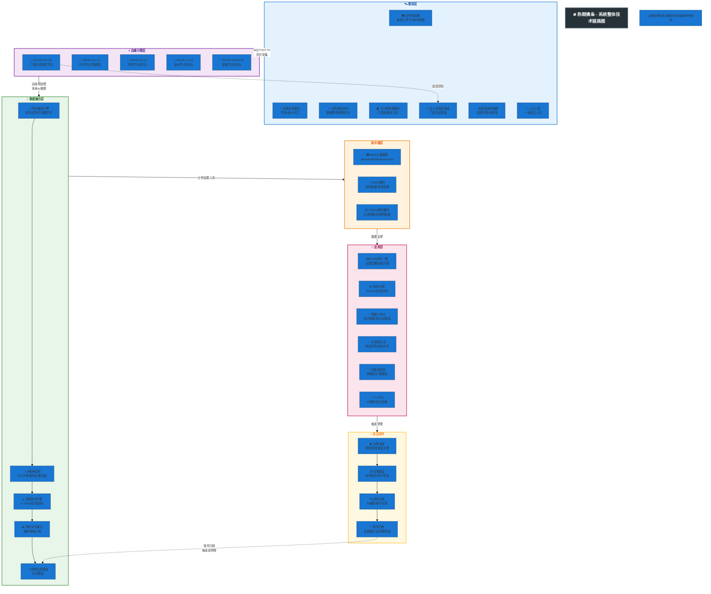
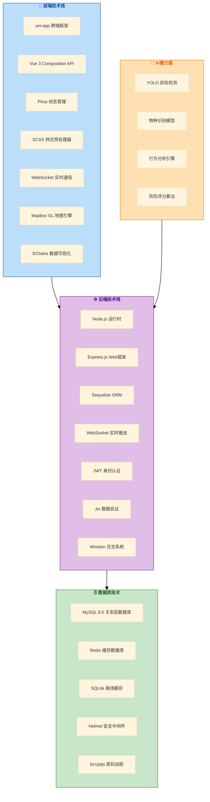
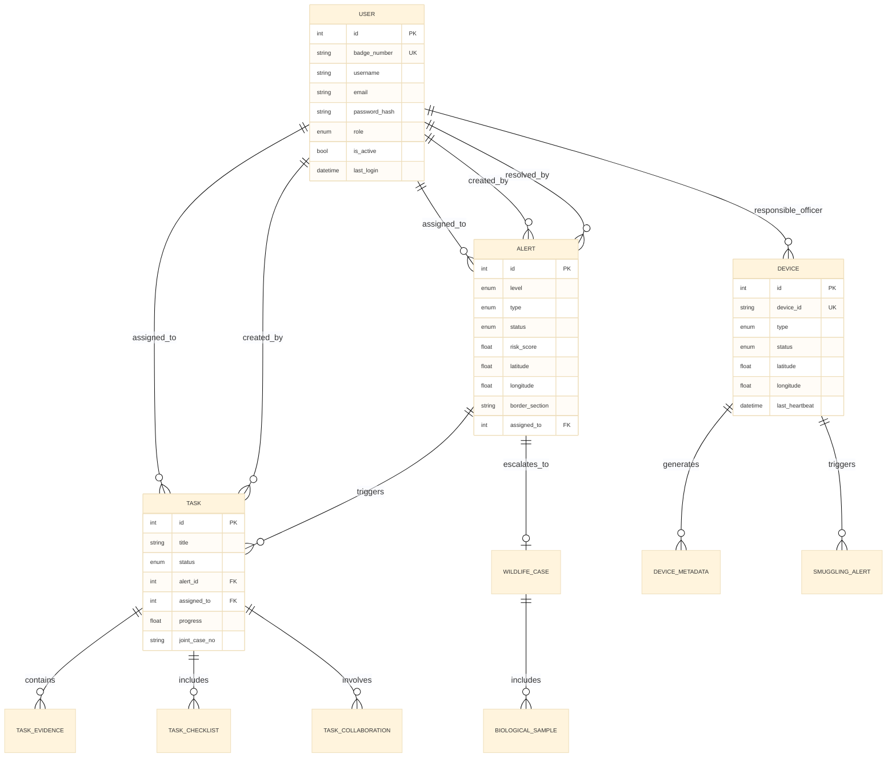
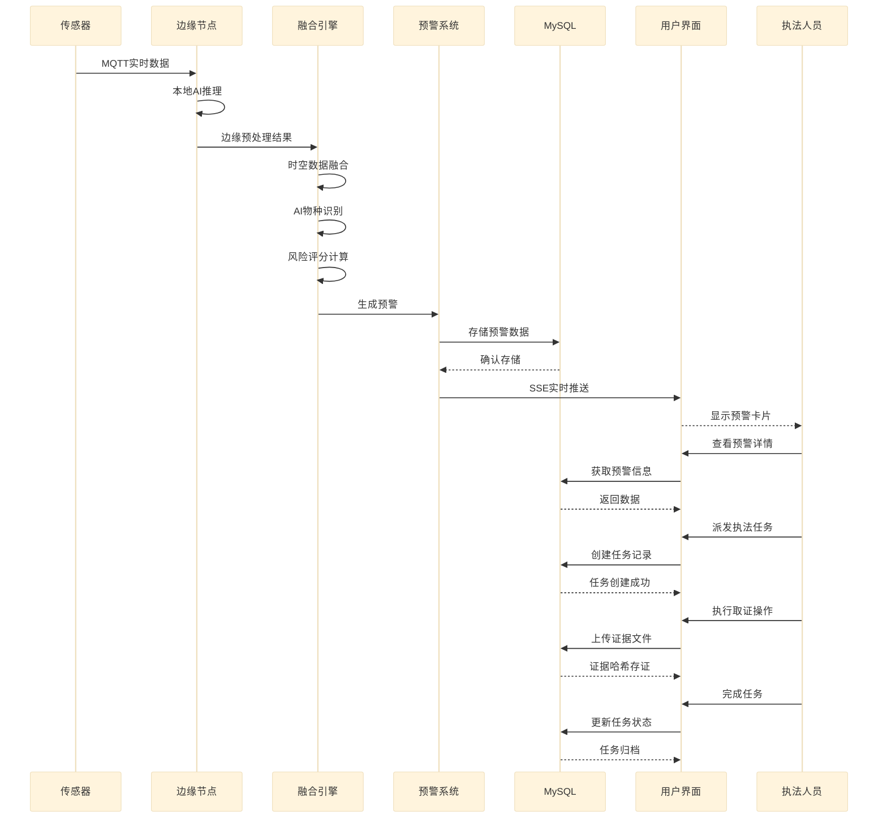
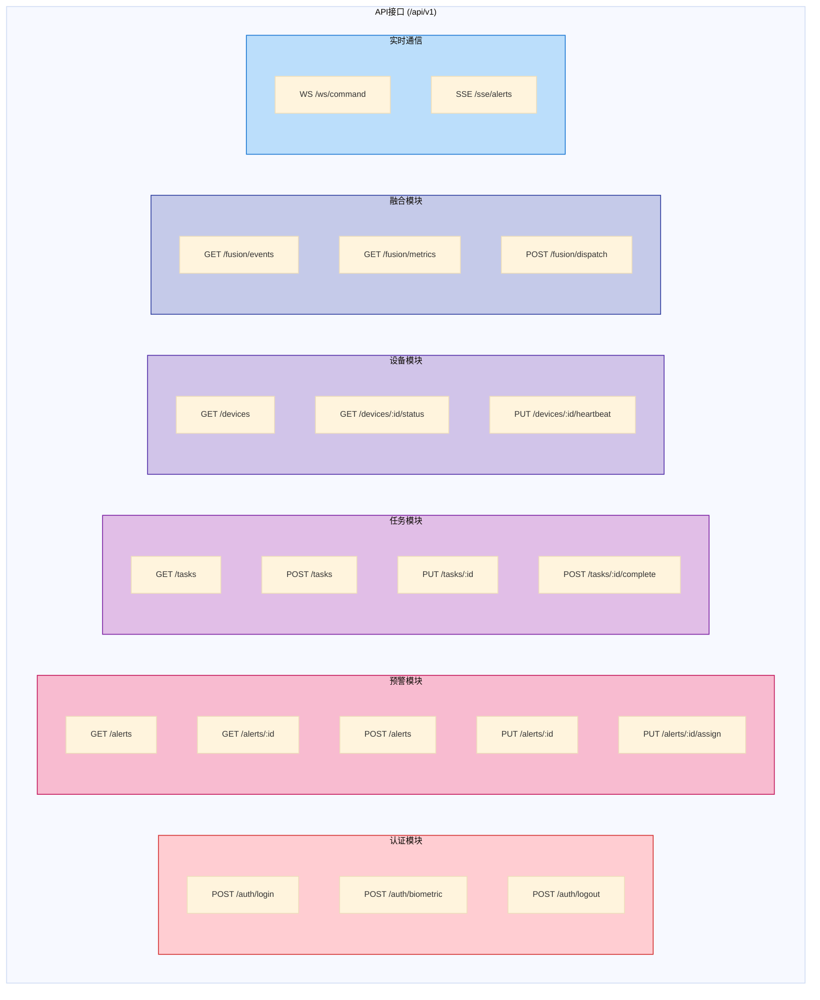

# 热眼擒枭 - 系统整体技术链路图

## 感知层 → 边缘计算层 → 数据融合层 → 存储层 → 应用层 → 执法闭环

---

### 一、整体链路架构图

---

### 二、技术栈全景图

---

### 三、数据流向链路图

```mermaid
%%{init: {'theme': 'base', 'themeVariables': {
    'fontSize': '11px'
}}}%%
flowchart LR
    subgraph INPUT["数据输入"]
        I1["传感器数据\n(MQTT)"]
        I2["图像/视频流\n(RTSP)"]
        I3["人工上报\n(REST API)"]
        I4["GPS轨迹\n(WebSocket)"]
    end

    subgraph EDGE_PROC["边缘计算处理"]
        E1["数据清洗"]
        E2["特征提取"]
        E3["本地AI推理"]
        E4["异常检测"]
    end

    subgraph CLOUD_PROC["云端融合处理"]
        C1["多源数据融合"]
        C2["时空对齐"]
        C3["AI二次识别"]
        C4["风险评分"]
    end

    subgraph OUTPUT["业务输出"]
        O1["实时预警推送"]
        O2["任务自动派发"]
        O3["GIS可视化"]
        O4["数据统计分析"]
    end

    INPUT --> EDGE_PROC
    EDGE_PROC --> CLOUD_PROC
    CLOUD_PROC --> OUTPUT

    classDef INPUT fill:#e3f2fd,stroke:#1976d2
    classDef EDGE_PROC fill:#f3e5f5,stroke:#7b1fa2
    classDef CLOUD_PROC fill:#e8f5e9,stroke:#388e3c
    classDef OUTPUT fill:#fce4ec,stroke:#c2185b

    class INPUT INPUT
    class EDGE_PROC EDGE_PROC
    class CLOUD_PROC CLOUD_PROC
    class OUTPUT OUTPUT
```

---

### 四、核心数据模型关系图

---

### 五、业务流程时序图

---

### 六、API接口链路图

---

### 七、技术特性总览表

| 层级 | 技术特性 | 实现方案 |
|:-----|:---------|:---------|
| **感知层** | 多源数据采集 | MQTT/RTSP/HTTP多协议支持 |
| | 边缘AI推理 | TensorRT/NCNN本地部署 |
| | 低延迟响应 | 边缘节点就近处理 |
| **融合层** | 时空数据融合 | 坐标对齐+时间戳同步 |
| | AI物种识别 | YOLO+专项分类模型 |
| | 风险量化评估 | 多维度加权评分算法 |
| **存储层** | 高并发读写 | MySQL主从+Redis缓存 |
| | 离线数据保障 | SQLite本地缓存+CRDT同步 |
| | 证据存证 | SHA-256哈希+时间戳 |
| **应用层** | 跨端统一体验 | uni-app一套代码多端运行 |
| | 实时数据推送 | SSE+WebSocket双通道 |
| | 离线优先 | 离线队列+智能同步 |
| **安全层** | 身份认证 | JWT+生物识别 |
| | 数据传输 | HTTPS+Token签名 |
| | 操作审计 | 完整日志+操作追溯 |

---

**热眼擒枭 - 用科技守护绿水青山，用智慧筑牢边境防线**
